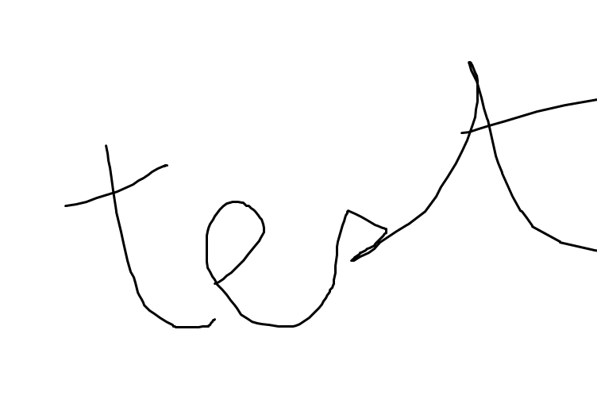

# 제목 1


## 제목 2


### 제목 3


#### 제목 4

일반 텍스트

**볼드 **처리

_기울기_

<span style="text-decoration:underline;">밑줄</span>

색깔 테스트 빨간색 초록색 파란색

링크 테스트 [구글](https://google.com)

로컬 이미지 테스트 

온라인 이미지 테스트 )

문단 중간에 들어간 ```코드 테스트```

코드 블록 테스트

```c

printf(“Hello, world!\n”);

```

불릿 테스트


* 첫 번째
* 두 번째
* 세 번째

숫자 테스트


1. 일
2. 이
3. 삼
4. 사